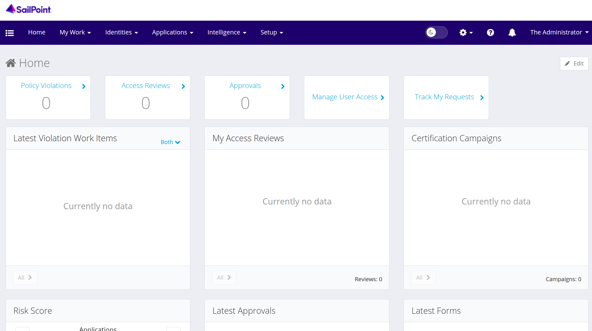
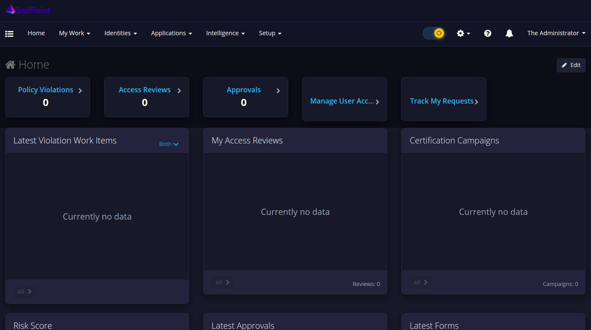

# SailPoint IdentityIQ - Theme Toggle Plugin

A lightweight plugin for SailPoint IdentityIQ 7.2+ that adds a light/dark theme toggle to the top navigation bar. The dark theme covers classic UI pages, Angular dashboards, Identity Warehouse, Certifications, and ExtJS dialogs.

## Screenshots

**Light mode (default)**



**Dark mode**



## Features

- **Header Toggle**: Switch between dark and light themes directly from the top navigation bar (persisted via `localStorage`).
- **Comprehensive Theme**: Styles classic JSP/XHTML pages, Angular home/dashboards, Identity Warehouse, Certifications, and ExtJS modals.
- **Dynamic Cleanup**: Handles inline white backgrounds and asynchronously rendered ExtJS grids without requiring a page reload.
- **Protected Elements**: Keeps CodeMirror, XML debug editors, status badges, and the Business Process Designer canvas readable.
- **Client-Side Only**: Zero backend dependencies, no database changes, and no external libraries required.

## Compatibility

- SailPoint IdentityIQ 7.2 and later (7.2 – 8.5+)
- Modern browsers (Chrome, Edge, Firefox, Safari)

## Download

* Direct download: [`ThemeTogglePlugin.zip`](./ThemeTogglePlugin.zip) - click the file and select **Download raw file**.

## Installation

1. Download `ThemeTogglePlugin.zip` directly from this repository.
2. Log in to IdentityIQ with `Plugin Administrator` capability.
3. Navigate to **Gear icon > Plugins > New**.
4. Upload `ThemeTogglePlugin.zip` and verify installation.
5. Refresh your browser to see the toggle in the navigation header.

## Building from source

The distributable is created by zipping the contents of `themetoggleplugin/` with `manifest.xml` at the root:

```bash
cd themetoggleplugin
zip -r ../ThemeTogglePlugin.zip manifest.xml installation ui
```

## Project structure

```
themetoggleplugin/
  manifest.xml
  installation/
    install.setup.xml
    upgrade.setup.xml
  ui/
    css/
      plugin.css
      theme-dark.css
      theme-light.css
    js/
      headerInject.js
    htmlTemplates/
      pluginSettings.html
```

## License

Distributed under the MIT License. See [LICENSE.txt](LICENSE.txt) for more information.
